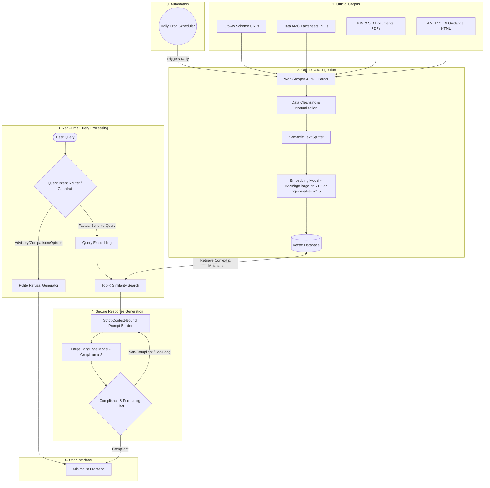

# Detailed System Architecture: Mutual Fund FAQ Assistant (Facts-Only Q&A)

## 1. Architectural Philosophy
The core principle of this architecture is **Compliance and Accuracy over Creativity**. Because the domain involves financial data, the system strictly implements a deterministic Retrieval-Augmented Generation (RAG) pattern with multiple hard guardrails. The system guarantees that no external knowledge, hallucinations, or advisory opinions bleed into the response.



---

## 2. Detailed Component Specifications

### 2.1. Offline Data Ingestion Pipeline
A dedicated **Daily Scheduler** (e.g., a Cron job, Apache Airflow, or AWS EventBridge) automatically triggers this pipeline every day to ensure the knowledge base is perfectly synchronized with the latest scheme data.

*   **Extraction Layer:**
    *   **PDF Parsing:** Employs advanced OCR/PDF parsing (e.g., `PyMuPDF` or `Unstructured.io`) to accurately extract structured tables and text blocks from SIDs, KIMs, and Factsheets, as financial data is heavily table-reliant.
    *   **HTML Scraping:** Extracts raw text from Groww URLs and AMC FAQ pages using `BeautifulSoup` or `Scrapy`, filtering out navigation headers and ads.
*   **Transformation & Chunking:**
    *   **Strategy:** Uses a Semantic Chunking strategy. Rather than blind character counts, the text is split by logical sections (e.g., "Expense Ratio", "Exit Load", "Investment Objective"). 
    *   **Metadata Injection:** Every single chunk *must* be tagged with `source_url`, `document_type`, `scheme_name`, and `last_updated_date`. This is critical for the citation requirement.
*   **Embedding & Storage:**
    *   **Model:** Uses a dense embedding model optimized for retrieval. Dynamically selects between `BAAI/bge-large-en-v1.5` (for high volume) and `BAAI/bge-small-en-v1.5` (for speed in lower volumes).
    *   **Vector Store:** A persistent local instance of ChromaDB indexed using HNSW (Hierarchical Navigable Small World) for fast, accurate similarity searches, ensuring built-in metadata filtering.

### 2.2. Guardrail & Routing Layer (The Gatekeeper)
Before hitting the primary LLM or Vector DB, the query is intercepted to ensure it meets the facts-only criteria.

*   **Intent Router (Classifier):** A lightweight classifier (can be rule-based regex or a small fast LLM like Llama-3-8B) evaluates the query.
    *   *Trigger Words:* "Should I", "recommend", "better", "buy or sell", "good investment", "forecast", "yield".
    *   *Action:* If triggered, bypasses RAG entirely and routes to the Refusal Handler.
*   **Refusal Handler:** Returns pre-approved, legally safe templates. 
    *   *Example Output:* "As a facts-only assistant, I cannot provide investment advice or comparisons. Please refer to an AMFI-registered financial advisor or view the [AMFI Investor Corner](https://www.amfiindia.com/) for educational resources."

### 2.3. Retrieval & Generation Pipeline
If the query is deemed factual (e.g., "What is the exit load for Tata Small Cap Fund?"), it proceeds to retrieval.

*   **Two-Stage Retrieval (Dense + Re-ranking):** 
    1. **Dense Retrieval:** The Vector DB is queried using Cosine Similarity with the BGE embeddings to retrieve a broader set of context (e.g., top $k=15$ chunks).
    2. **Cross-Encoder Re-ranking:** A re-ranker model (e.g., `BAAI/bge-reranker-base`) scores the retrieved chunks against the exact user query. This dramatically improves precision for specific numeric values, acronyms, and exact keyword matches, filtering down to the best 3-5 chunks to pass to the LLM.
*   **Strict Prompt Engineering:** The context and query are injected into a highly constrained system prompt.
    ```text
    SYSTEM: You are a strict, facts-only mutual fund assistant. 
    You must answer the user's question using ONLY the provided context.
    If the context does not contain the answer, you MUST say "I cannot find this information in the official documents."
    
    CONSTRAINTS:
    1. Maximum 3 sentences.
    2. Provide exactly one source link from the metadata.
    3. You must append the string "Last updated from sources: <date>" to the end of your response, using the date from the metadata.
    4. Do not offer opinions or calculations.
    
    CONTEXT: {retrieved_chunks}
    METADATA: {chunk_metadata}
    ```
*   **LLM Configuration:** 
    *   **Temperature:** Set to `0.0` to eliminate creativity and enforce deterministic outputs.
    *   **Model:** Groq's high-speed inference engine using a highly capable instruction-following model (e.g., Llama-3-70B).
*   **Post-Processing Filter:** A final script checks the LLM's output. If the output exceeds 3 sentences, lacks a URL, or lacks the updated date footer, a fallback mechanism is triggered (e.g., returning a generic error or retrying the generation).

### 2.4. Minimalist User Interface
A lightweight frontend (built with React, Streamlit, or Gradio) that focuses purely on utility.

*   **Components:**
    *   **Header:** "Mutual Fund FAQ Assistant"
    *   **Disclaimer Banner:** Prominently displayed in red or bold at the top: *"Facts-only. No investment advice."*
    *   **Quick Prompts:** 3 clickable pill buttons for example questions (e.g., "What is the benchmark index for Tata Digital India Fund?").
    *   **Chat Window:** Standard chat interface displaying the user query and the assistant's formatted response (with the mandatory footer).

## 3. Security, Privacy, and Compliance Architecture

*   **Stateless Processing:** The backend APIs are fully stateless. No session state or user identifiers are logged in the database.
*   **PII Filtering:** A middleware layer (e.g., Microsoft Presidio) can be optionally added to scrub any inadvertent PII (PAN, Aadhaar, phone numbers) from the user's query *before* it is logged or embedded.
*   **Audit Logging (No PII):** The system logs incoming queries (scrubbed), the intent classification score, the retrieved chunks, and the generated response. This is necessary for compliance auditing to prove the system is not dispensing financial advice.
